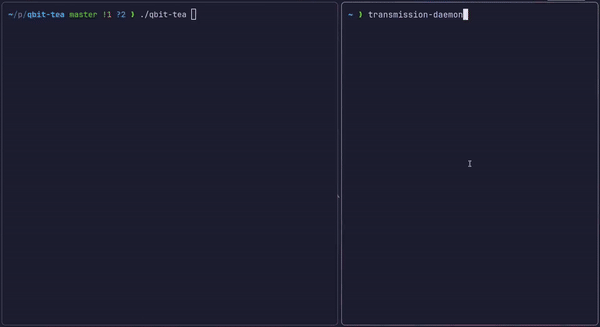

# qbit-tea

A TUI for controlling **transmission-daemon**.



## Features

- Add new torrents using magnet links
- Remove, pause, and resume torrents
- Overview of all torrents
- Supports daemon running on a remote host

## Use case

~~This tool was primarily made to use with [jellyfin](https://github.com/jellyfin/jellyfin). The main idea is to make adding torrents to media folders easier.~~

> It was made for jellyfin, but now you can use to manage torrents in general.
> If you want to see the original intent, check the README until commit [2848c75](https://github.com/luiz734/qbit-tea/commit/2848c758054be706c5d6ae34f33f84fe64222077).

> Because of that, there is a lot of refactoring happening on the main branch. If you want to use this tool, it's better to stick with the release.

This tool is a generic TUI for transmission-daemon on linux. Good for managing tranmission-daemons running on servers.

## Installation

You only need `go`. All the dependencies will be downloaded during compilation.

## Usage

- **Local**: run without any arguments.
- **Remote**: `qbit-tea -a 10.8.0.1:9091 -u tuser -p tpass`
- Use the flag `-h` for details.
- Make sure `transmission-daemon` is running before starting the program.
- Use the `DEBUG=1` environment variable to see log messages.

### Keybinds

- `k` `up` move up
- `j` `down` move down
- `a` add torrent
- `u` update list manually (it updates each 2 seconds)
- `d` remove torrent from transmission (the file will not be deleted from disk)
- `p` pause/resume download

## Config

- You can define a set of directories to chose from before each download.
- Config file is created automatically in `~/.config/qbit-tea/config.toml`.
- The default config looks like this:

```toml
# You can choose from before download
# Items appear in the order they are declared
download_dirs = [
    "/jellyfin/movies",
    "/jellyfin/shows",
]
```
