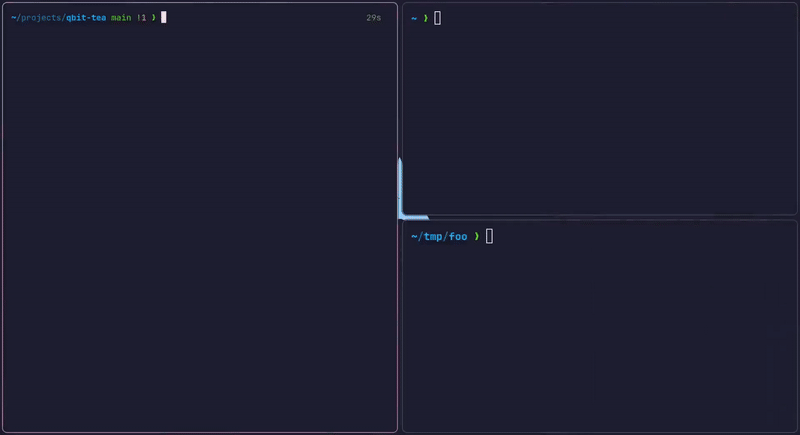

# qbit-tea

A TUI for controlling **transmission-daemon**.



## Features

- Add new torrents using magnet links
- Remove, pause, and resume torrents
- Overview of all torrents
- Supports daemon running on a remote host

## Use case

This tool was primarily made to use with [jellyfin](https://github.com/jellyfin/jellyfin). The main idea is to make adding torrents to media folders easier.

I have two directories on a remote host: `/jellyfin/movies` and `/jellyfin/shows/`. Jellyfin automatically organizes your movies and shows based on the directory structure. For example:

```
/jellyfin/movies
    movieA
    movieB
/jellyfin/shows
    showA
        season1
        season2
    showB
        season1
```

Before adding torrents, you will be prompted to choose a movie or a show.
If you choose `movie`, the download starts immediately.
If you pick `show`, you will be asked for the show name (in the example, `showA` or `showB`).
The torrent will be downloaded in the appropriate directory.

> Don't worry about the name of the torrent being downloaded.
> Jellyfin is smart enough to figure out which season is inside each directory, so no need to rename your downloads to `seasonX`.

## Installation

You only need `go`. All the dependencies will be downloaded during compilation.

## Usage

- **Local**: run without any arguments.
- **Remote**: `qbit-tea -a 10.8.0.1:9091 -u tuser -p tpass`
- Use the flag `-h` for details.
- Make sure `transmission-daemon` is running before starting the program.
- Use the `DEBUG=1` environment variable to see log messages.

## Customization

At the moment, a lot of things are hardcoded (e.g. the jellyfin directories).
I may change them in the future.
